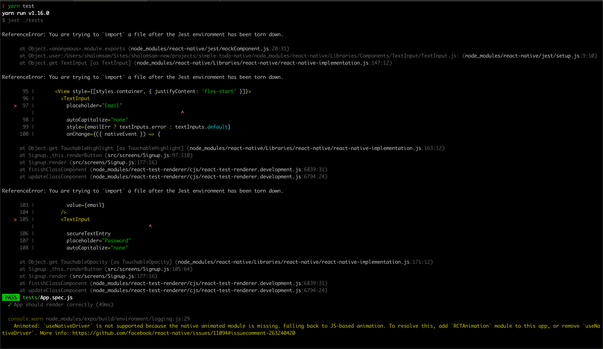
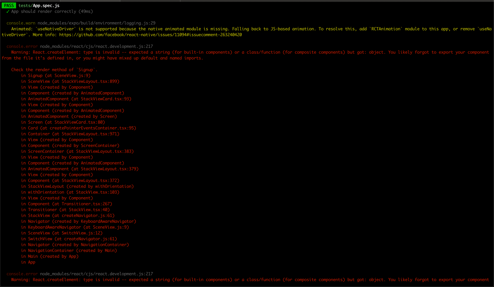
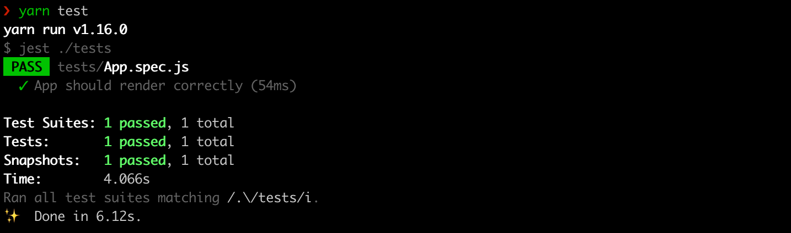

I am writing this (very) brief tutorial to help any fellow developer facing the same problems I did while trying to get my Expo/React Native App setup with Jest for unit tests. I had a hard time finding any relevant information on the topic. And what information I did find seemed to be incomplete in most cases. So let's get right to it.

**Note**: In this tutorial I will not dive into writing actual tests. I'll cover that in another article. Here I'll only address how to setup your app with Jest so that you can get to writing some tests hassle free.

## 1. Installing Dependencies:

- [Jest / Jest-Expo](https://docs.expo.io/versions/latest/guides/testing-with-jest/)
- [react-test-renderer](https://github.com/facebook/react/tree/master/packages/react-test-renderer) / [react-native-testing-library](https://github.com/callstack/react-native-testing-library)
- [firebase-mock](https://github.com/soumak77/firebase-mock)

Jest-Expo is only needed if you are working on an Expo App. You could choose to use either react-test-renderer or react-native-testing-library. You don’t need both, as react-native-test-library is built on top of react-test-renderer. Also if you are planning to use Enzyme, consider using react-native-testing-library instead, as it is a replacement for Enzyme (as mentioned [here](https://github.com/callstack/react-native-testing-library#this-solution)). Eliminating the need to install multiple libraries. So let's go ahead and install these dependencies using the following command:

- If you are using yarn, run:

```bash
yarn add --dev jest jest-expo react-test-renderer firebase-mock
```

OR

- If you are using npm, run:

```bash
npm i jest jest-expo react-test-renderer firebase-mock --save-dev
```

## 2. Setup:

The expo app requires a lil setup before you can start running tests. Update your `package.json` file to include the following lines:

```json file=package.json
"scripts": {
  // SNIP
  "test": "jest ./tests"
},
"jest": {
  "preset": "jest-expo",
  "rootDir": ".",
  "transform": {
    "^.+\\.js$": "babel-jest"
  },
  "transformIgnorePatterns": [
    "node_modules/(?!((jest-)?react-native|react-clone-referenced-element|expo(nent)?|@expo(nent)?/.*|react-navigation|@react-navigation/.*|sentry-expo|native-base))"
  ]
},
```

The `"jest"` configuration can be used for React Native Apps as well.

## 3. Write a Simple Test:

Now create a `tests` directory in the root of your project, and add a file that we will name `App.spec.js`. Let's add a simple [snapshot test](https://jestjs.io/docs/en/snapshot-testing) to check that our current setup works:

```jsx file=App.spec.js
import "react-native"
import React from "react"
import renderer from "react-test-renderer"
import App from "../App"

it("App should render correctly", () => {
  const tree = renderer.create(<App />).toJSON()
  expect(tree).toMatchSnapshot()
})
```

Now if we run `yarn test` or `npm run test`, even though the test may pass, you might see a bunch of errors like the ones you see in the below images:

Weird errors even though the test seems to pass!


And some more errors! 😱
Now, these errors could be very misleading to what the real problem is. What you need to do next is Mock Firebase.

## 4. Mocking Firebase for Testing

The main purpose of adding `[firebase-mock](https://github.com/soumak77/firebase-mock)` was to provide an easy way to mock the firebase SDK so that your tests don't actually hit the remote firebase database. Now, at the time of writing this article, I could not find proper documentation on how to actually use `firebase-mock`. The implementation suggested by the `firebase-mock` seemed rather incomplete. And thus began my nightmare of finding a firebase mock. I found a lot of snippets and gists out there, but most were incomplete or outdated & unmaintained. Which also made me realize that depending on a library that was meant for mocking made more sense from a maintainability stand point. But alas how do I use it. After a lot of searching around, I finally found how to use `firebase-mock`. To use this, first, we create a new `__mocks__` directory, that will contain all our mocks. _Ideally, I would have loved to have this directory under the directory that we created. But I couldn't find any good solution on how to achieve this at the moment in Jest_. Now we create a file with the filename matching that of the library we are trying to mock. In our case, the file name will be `firebase.js`, as we need to mock the firebase library. Open the newly created `firebase.js` and add the following code in it:

```jsx file=firebase.js
import firebasemock from "firebase-mock"

const mockdatabase = new firebasemock.MockFirebase()
const mockauth = new firebasemock.MockFirebase()
const mocksdk = new firebasemock.MockFirebaseSdk(
  path => (path ? mockdatabase.child(path) : mockdatabase),
  () => mockauth
)

export default mocksdk
```

Now if you return to your terminal and run `yarn test` or `npm run test` once you again you'll see 🦄🌈, kidding, but you'll see that the errors have magically gone away and your test succeeds.



Passing test with no random errors!

## 5. What step 5!?

Nope, no more steps other than that you can start writing some tests now! Jest supports Unit Testing, but, if you need to do End-To-End (e2e) testing then I'd suggest using Detox. You can find a good article on setting up Detox in your project for e2e testing [here](https://blog.expo.io/testing-expo-apps-with-detox-and-react-native-testing-library-7fbdbb82ac87).

## That's All Folks! 🐰🥕

Thanks for reading this article. I hope this article has been helpful to you and has spared you some trouble in setting up Jest at the very least. Hopefully, you don't have to struggle as I did trying to set up testing for my Expo/React Native project.

> Hi 👋, I’m [Shalom Sam](https://react.shalomsam.com/) a Full Stack Developer. I have been working as a developer for a lil over 9 years now. I’m a code-aholic and love building stuff on the web, and now on native devices thanks to React Native. I hope this article was helpful in some way. If you did like this article and would like to see more like these please share & subscribe. **✌️**
