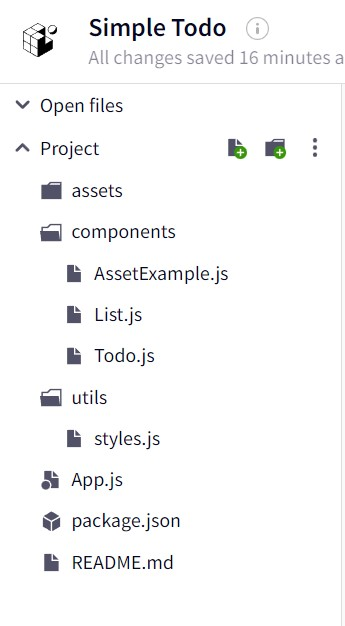

What is **React Native** you ask? React Native is Facebook's answer to writing code in Javascript using the familiar React fundamentals and coding style to build native iOS and Android apps. React Native exposes the native platform's features to the developer through a large number of inbuilt components and APIs.

> TLDR;
>
> You can find the working app on [Expo.io](https://expo.io/@shalom.s/simple-todo-native) & the complete code on [GitHub](https://github.com/shalomsam/RN-Todo-App).

### Audience

This tutorial is for both beginners and professionals alike. This tutorial assumes you have some prior Javascript/React.js experience at the very least. Even then I'll try and be as descriptive as possible. In this tutorial, I'll set out to build a very basic to-do app and then add features and improvements in subsequent tutorial article(s) like this one, making it simpler to follow.

### Getting Started

Now there are a few ways to get started with React Native. But the easiest and probably the quickest way to get started would be to use the [Expo Snack](https://snack.expo.io/), especially for a simple application as the one I am about to demonstrate here. You could also get started with the React Native CLI as well, described in detail [here](https://facebook.github.io/react-native/docs/getting-started).

The code for this tutorial will be written in a snack. However, if you'd prefer to develop it locally, follow the steps below :-

First, ensure you have [Node v10+](https://nodejs.org/en/download/). Then install the Expo CLI using the following command:

```bash
npm install -g expo-cli
```

Once Expo CLI is installed we can create a new React Native project by running :

```bash
expo init react-native-todo
```

Then simply `cd react-native-todo` and run `npm start` to start the development server.

To run the app you should install the Expo client app from the respective [iOS  App Store](https://itunes.apple.com/app/apple-store/id982107779) or [Android App Store](https://play.google.com/store/apps/details?id=host.exp.exponent&referrer=www) on your device. Once installed, on Android, use the Expo app to scan the QR code from your terminal to open your project. And on iOS, follow on-screen instructions to get a link.

This should load your app on the expo client. Go ahead and make changes to the `App.js` file in your project and see the changes reflect on the Expo Client App.

### Let's get started with our ToDo App

If you open App.js the initial code should look like this:

```jsx file=App.js
import * as React from 'react'
import { Text, View, StyleSheet } from 'react-native'
import { Constants } from 'expo'

// You can import from local files
import AssetExample from './components/AssetExample'

// or any pure javascript modules available in npm
import { Card } from 'react-native-paper'

export default class App extends React.Component {
  render() {
    return (
      <View style={styles.container}>
        <Text style={styles.paragraph}>
          Change the code in the editor and watch it change on your phone! Save
          to get a shareable URL.
        </Text>
        <Card>
          <AssetExample />
        </Card>
      </View>
    )
  }
}

const styles = StyleSheet.create({
  container: {
    flex: 1,
    justifyContent: 'center',
    paddingTop: Constants.statusBarHeight,
    backgroundColor: '#ecf0f1',
    padding: 8,
  },
  paragraph: {
    margin: 24,
    fontSize: 18,
    fontWeight: 'bold',
    textAlign: 'center',
  },
})
```

\*_Note that the initial code in App.js might look different depending on whether you used the React Native CLI or Expo CLI or the Expo Web editor called Snack._

**1. Directory structure**

The Directory structure for this app should look something like this:


The `components` directory contains the two components that we'll need for this app, List.js & Todo.js. List.js builds the complete list of todos. While Todo will build the individual Todo. 

The `util` directory contains a single file style.js, which holds our basic styles used in this tutorial.


**2. First changes**

First lets define what our list shape should like for better and clearer direction:

```jsx file=App.js

// ... Rest of the Code ...

export const TodoStatus = {
  open: 'open',
  inProgress: 'inProgress',
  completed: 'completed',
};

const initialList = [
  {
    title: 'This is a todo title',
    description: 'Detailed notes for the Todo',
    status: TodoStatus.open
  },
  {
    title: 'This is another todo',
    description: 'Additional details of the TOdo',
    status: TodoStatus.inProgress
  },
  {
    title: 'This is the third todo',
    description: 'Third todo description',
    status: TodoStatus.completed
  }
]

// ... Rest of the Code ...
```

Now that we have the list & todo shape defined. We can start by building the layout for the app. The `App.js` file itself will just hold the state of the list and that of the input field `TextInput` we'll be adding. This input field will allow us to add new todo.

When put together the `App.js` code will look like this -

```jsx file=App.js
import * as React from 'react';
import { Text, View, TextInput, StyleSheet } from 'react-native';
import Constants from 'expo-constants';
import { Card } from 'react-native-paper';
import { TodoStatus } from './components/Todo';
import { colors } from './utils/styles';
import List from './components/List';

const initialList = [
  {
    title: 'This is a todo title',
    description: 'Detailed notes for the Todo',
    status: TodoStatus.open
  },
  {
    title: 'This is another todo',
    description: 'Additional details of the TOdo',
    status: TodoStatus.inProgress
  },
  {
    title: 'This is the third todo',
    description: 'Third todo description',
    status: TodoStatus.completed
  }
];

const localStyles = {
  input: {
    padding: '10px',
    fontSize: '18px',
    fontStyle: 'italic',
    outline: 'none',
    borderBottom: `1px solid ${colors.darkGrey}`,
  }
}

export default function App() {

  const [ list, updateList ] = React.useState(initialList);
  const [ newEntry, updateEntry ] = React.useState('');

  return (
    <View style={styles.container}>
      <Text style={styles.paragraph}>
        TODO List
      </Text>
      <Card>
        <TextInput
          placeholder="What do you want to do today?"
          autoCapitalize="none"
          style={localStyles.input}
          onChange={({ nativeEvent }) => {
            updateEntry(nativeEvent.text);
          }}
          onSubmitEditing={({ nativeEvent }) => {
            updateList([...list, {
              title: nativeEvent.text,
              description: '',
              status: TodoStatus.open
            }])
            updateEntry('');
          }}
          value={newEntry}
        />
        <List list={list} updateList={updateList} />
      </Card>
    </View>
  );
}

const styles = StyleSheet.create({
  container: {
    flex: 1,
    justifyContent: 'top',
    paddingTop: Constants.statusBarHeight,
    backgroundColor: '#ecf0f1',
    padding: 8,
  },
  paragraph: {
    margin: 24,
    fontSize: 18,
    fontWeight: 'bold',
    textAlign: 'center',
  },
});

```

**3. Adding the components**

Now that we have the basic structure in place it is time to add the missing components that will make this app functional. Let's first start by adding the `<List />` component. As you can see above the list component takes two props, the `list` itself, which is a an array of Todo and `updateList` which is the useState callback that we will pass down to the children to enable updating the todo status in the list.

The code for the `List` component should look like this -

```jsx file=./components/List.js
import React from 'react';
import { Text, View } from 'react-native';
import PropTypes from 'prop-types';
import Todo, { TodoStatus } from './Todo';

const List = ({ list, updateList }) => {
  let TodoView = (
    <Text>No Todos added.</Text>
  );

  if (list && list.length) {
    const ListView = list.map((todo, i) => {
      return (
        <Todo key={`todo-${i}`} index={i} {...todo} updateList={updateList} />
      )
    });

    TodoView = (
      <View>
        {ListView}
      </View>
    )
  }

  return TodoView;
}

List.propTypes = {
  list: PropTypes.arrayOf(PropTypes.shape({
    title: PropTypes.string,
    description: PropTypes.string,
    status: PropTypes.oneOf(Object.values(TodoStatus)),
  })),
  updateList: PropTypes.func.isRequired,
};

export default List;
```

Next we'll add the `<Todo />` component. This component will define the UI structure and basic functionality of the individual `Todo` items. At the very begining of this article we had decided the shape of individual Todo items, i.e. - 

```js
{
  title: 'This is another todo',
  description: 'Additional details of the TOdo',
  status: TodoStatus.inProgress
}
```

These properties will form the base input for the component. Apart from that, it also accepts the `index` prop, to identify the position of individual Todo within the list, and the `updateList` prop to faciliate updating the todo props within the list.

So the final code for the `<Todo />` component should look like this - 

```jsx file=./components/Todo.js
import React from 'react';
import PropTypes from 'prop-types';
import { View, Text, TouchableOpacity, StyleSheet } from 'react-native';
import {
  MaterialCommunityIcons
} from '@expo/vector-icons';
import { typography, colors } from '../utils/styles';

export const TodoStatus = {
  open: 'open',
  inProgress: 'inProgress',
  completed: 'completed',
};

const localStyles = StyleSheet.create({
  container: {
    width: '100%',
    position: 'relative',
    flexDirection: 'row',
    alignItems: 'center',
  },
  iconLeft: {
    marginRight: '5px',
    marginTop: '2px'
  },
  todo: {
    flexDirection: 'row',
    alignItems: 'center',
    padding: 10,
    backgroundColor: '#ffffff',
    borderBottom: `1px solid ${colors.lightGrey}`,
    elevation: 5,
    position: 'relative',
  }
});

const Todo = ({ index, title, description, status, updateList }) => {
  let checkIcon = <MaterialCommunityIcons
    name="checkbox-blank-outline"
    size={24}
    color={colors.lightGrey}
    style={localStyles.iconLeft}
  />;

  if (status === TodoStatus.inProgress) {
    checkIcon = <MaterialCommunityIcons 
      name="checkbox-intermediate"
      size={24}
      color={colors.skyBlue}
      style={localStyles.iconLeft}
    />;
  } else if (status === TodoStatus.completed) {
    checkIcon = <MaterialCommunityIcons
      name="checkbox-marked"
      size={24}
      color={colors.green}
      style={localStyles.iconLeft}
      title="complete"
    />
  }

  return (
    <TouchableOpacity
      style={localStyles.todo}
      onPress={(e) => {
        let updatedStatus;
        if (status === TodoStatus.open) {
          updatedStatus = TodoStatus.inProgress;
        } else if (status === TodoStatus.inProgress) {
          updatedStatus = TodoStatus.completed;
        } else if (status === TodoStatus.completed) {
          updatedStatus = TodoStatus.open;
        }
        updateList && updateList((list) => {
          list[index].status = updatedStatus;
          return [...list];
        })
      }}>
      <View style={localStyles.container}>
        {checkIcon}
        <Text style={typography.h4}>
          {title.charAt(0).toUpperCase()}
          {title.slice(1)}
        </Text>
      </View>
    </TouchableOpacity>
  );
};

Todo.propTypes = {
  index: PropTypes.number,
  title: PropTypes.string.isRequired,
  description: PropTypes.string,
  status: PropTypes.oneOf(Object.values(TodoStatus)),
  updateSelf: PropTypes.func.isRequired,
};

export default Todo;
```
Since this tutorial was intended to be a simple one, the only udpate really happening in the individual todo is the status. Clicking on individual todo will cycle the status of that Todo between "open", "inProgress" or "completed". 

**4. Adding the base styles**

Finally we can add the basic colors/styles referenced in the `utils/style.js`. Now all the styles could be contained in a single style file or separate ones, you can pick what seems most favourable to you. The styles I have in place look like this, but feel free to add your own creativity to it - 

```js file=./utils/styles.js
export const colors = {
  darkGrey: '#333',
  lightGrey: '#e2e6ea',
  skyBlue: '#82AAE3',
  green: '#54B435'
};

export const fontColorDark = colors.darkGrey;
export const bold = { fontWeight: 'bold', color: fontColorDark };
export const typography = {
  h4: {
    ...bold,
    fontSize: 18,
  },
};

```
Note: I am not using the `StyleSheet.create()` here. At the time of writing this article there are no significant benifits between using one vs the other. The only benifit I could think of is any future benifits that could come from optimizations that maybe added by the react native team. But until then basic objects as styles will work just fine.
With that this tutorial comes to an end. Hope this was fun and helpful to all you enthusiastic engineers. Here is the complete code on Expo Snack - 

<Snack snackId="@shalom.s/simple-todo" />

### Conclusion
--------------
So as you may have observed writing code for a React Native/Expo application is very similar to writing one for a react web application. The only main key differences are the base level components used to replace the html that you'd normally use for web application. You'll get more familiar with all the components exposed by React Native as we dwell on more complex applications. But largerly the fundementals that you learn when working with a react application are largerly transferable. 