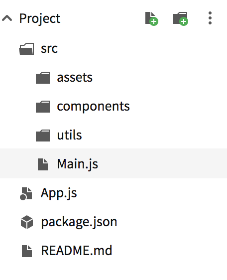
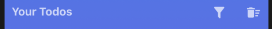

What is **React Native** you ask? React Native is Facebook's answer to writing code in Javascript using the familiar React fundamentals and coding style to build native iOS and Android apps. React Native exposes the native platform's features to the developer through a large number of inbuilt components and APIs.

> TLDR;
> 
> You can find the working app on [Expo.io](https://expo.io/@shalom.s/simple-todo-native) & the complete code on [GitHub](https://github.com/shalomsam/RN-Todo-App).

### Audience

This tutorial is for both beginners and professionals alike. This tutorial assumes you have some prior Javascript/React.js experience at the very least. Even then I'll try and be as descriptive as possible. In this tutorial, I'll set out to build a very basic to-do app and then add features and improvements in subsequent tutorial article(s) like this one, making it simpler to follow.

### Getting Started

Now there are a few ways to get started with React Native. But the easiest way to begin is to install using the Expo CLI. You could also get started with the React Native CLI as well, described in detail [here](https://facebook.github.io/react-native/docs/getting-started).

An even faster and easier way to get started is on the web on [Snack](https://snack.expo.io/). The code for this tutorial will be written in a snack. However, if you'd prefer to develop it locally, follow the steps below:-

First, ensure you have [Node v10+](https://nodejs.org/en/download/). Then install the Expo CLI using the following command:

```bash
npm install -g expo-cli
```    

Once Expo CLI is installed we can create a new React Native project by running :

```bash
expo init react-native-todo
```

Then simply `cd react-native-todo` and run `npm start` to start the development server.

To run the app you should install the Expo client app from the respective [iOS  App Store](https://itunes.apple.com/app/apple-store/id982107779) or [Android App Store](https://play.google.com/store/apps/details?id=host.exp.exponent&amp;referrer=www) on your device. Once installed, on Android, use the Expo app to scan the QR code from your terminal to open your project. And on iOS, follow on-screen instructions to get a link.

This should load your app on the expo client. Go ahead and make changes to the `App.js` file in your project and see the changes reflect on the Expo Client App.

### Let's get started with our ToDo App

If you open App.js the initial code should look like this:

```jsx
// App.js

import * as React from 'react';
import { Text, View, StyleSheet } from 'react-native';
import { Constants } from 'expo';

// You can import from local files
import AssetExample from './components/AssetExample';

// or any pure javascript modules available in npm
import { Card } from 'react-native-paper';

export default class App extends React.Component {
  render() {
    return (
      <View style={styles.container}>
        <Text style={styles.paragraph}>
          Change the code in the editor and watch it change on your phone! Save to get a shareable URL.
        </Text>
        <Card>
          <AssetExample />
        </Card>
      </View>
    );
  }
}

const styles = StyleSheet.create({
  container: {
    flex: 1,
    justifyContent: 'center',
    paddingTop: Constants.statusBarHeight,
    backgroundColor: '#ecf0f1',
    padding: 8,
  },
  paragraph: {
    margin: 24,
    fontSize: 18,
    fontWeight: 'bold',
    textAlign: 'center',
  },
});
```

**Note that the initial code in App.js might look different depending on whether you used the React Native CLI or Expo CLI or the Expo Web editor called Snack.*

**1. Directory structure**

The Directory structure for this app should look something like this:


So the main logic of the app resides under the newly created `src` directory. We'll also go ahead and move/create the `component` & `utils` directories under the `src` directory. You'll observe that I have created a new file called `Main.js` this will handle the main screen of the app. Since this app currently has only one screen I haven't created a separate `screens` directory. You may see this in later articles.

Let's go ahead and clean-up `App.js` such that it only imports `Main.js`. Hence, your `App.js` should look like this:

```jsx
// App.js
import * as React from 'react';
import Main from './src/Main';

export default class App extends React.Component {
  render() {
    return <Main />;
  }
}
```

And our `src/Main.js` should look like this:

```jsx
// src/Main.js
import * as React from 'react';
import { Text, View, StyleSheet } from 'react-native';
import { Constants } from 'expo';

// or any pure javascript modules available in npm
import { Card } from 'react-native-paper';

export default class App extends React.Component {

  render() {
    return (
      <View style={styles.container}>
        <Text style={styles.paragraph}>
          Change code in the editor and watch it change on your phone! Save to get a shareable url.
        </Text>
      </View>
    );
  }
}

const styles = StyleSheet.create({
  container: {
    flex: 1,
    justifyContent: 'center',
    paddingTop: Constants.statusBarHeight,
    backgroundColor: '#ecf0f1',
    padding: 8,
  },
  paragraph: {
    margin: 24,
    fontSize: 18,
    fontWeight: 'bold',
    textAlign: 'center',
  },
});
```    

Let's also add a simple util file called `styles.js` under the `utils` directory:

```js
// src/utils/styles.js

export const styles = {
  fontColor: '#ffffff',
  fontSize: 16,
  appBackgroundColors: ['#4776E6', '#8E54E9']
}
```

This file will hold our app-wide common style properties, like font style, colors, background colors, etc.

**2. Adding a header**

Let's create a `Header` Component under the component directory. We will create a simple function based component that will receive the Header title as a prop:

```jsx
// src/Header.js

import React from 'react';
import { View, Text, StyleSheet } from 'react-native';
import { styles as GlobalStyles } from '../utils/styles'

export const Header = (props) => {
  return (
    <View style={styles.header}>
      <Text style={styles.headerText}>{props.title}</Text>
    </View>
  );
}

const styles = StyleSheet.create({
  header: {
    flex: 1,
    height: 30,
    textAlign: 'center',
    justifyContent: 'center'
  },
  headerText: {
    fontSize: GlobalStyles.fontSize,
    fontColor: GlobalStyles.fontColor,
    fontWeight: '800'
  }
});
``` 

Here we have imported the `src/utils/styles.js`, that we created earlier, and used the styles defined within it. You'll observe that I have to import it as `GlobalStyles`, this is to avoid name conflict with the already defined `styles` variable.

Now that we created the `Header` component we need to use it in our `Main.js` file. But, but before we do that let's go ahead delete everything inside the render method, and redo the layout. I'll start by adding `state` in the `constructor()` method and instantiating `todos` as an empty `Array`, `loading` as a `Boolean`, and a single `todo` as an empty `String` to handle the todo input from the user (which we'll add later). Then I'll import `StatusBar` from `react-native` & `LinearGradient` from `exp`. The `StatusBar` component allows us to control the background color of the status bar and font color of the items it holds. In this app, I plan to just have a gradient background color for the complete app, which we can achieve with the `LinearGradient` component. So altogether our `Main.js` code should look like this:

```jsx
// src/Main.js

import * as React from 'react';
import { StatusBar } from 'react-native';
import { LinearGradient } from 'expo';
import { styles as GlobalStyles } from './utils/styles';
import { Header } from './components/Header';

export default class Main extends React.Component {
  constructor(props) {
    super(props);

    this.state = {
      todo: '',
      loading: true,
      todos: [],
    };
  }

  render() {
    return (
      <LinearGradient style={{flex: 1}} colors={GlobalStyles.appBackgroundColors}>
        <StatusBar barStyle='light-content' />
        <Header title='Todo App' />
      </LinearGradient>
    );
  }
}
```

---

**3. Add an Input Element**

Now that we have a `Header` it's time to add an Input field, where the user can enter/type their Todo. For this, we'll use the `TextInput` component provided by React Native, which we will wrap in a `View` container. Below the `TextInput` within this container, we will also add the `ScrollView` component, provided by React Native, which will contain our list of todos. For now, we'll just leave a default text in there. Now the code changes in `Main.js` should look like this:

```jsx
// src/Main.js

// ... (other imports)
import { StatusBar, View, TextInput, StyleSheet, ScrollView, Text } from 'react-native';
// ...

export default class Main extends React.Component {
  constructor(props) {
    super(props);

    this.state = {
      todo: '',
      loading: true,
      todos: [],
    };
  }

  addTodo = () => {
    if (this.state.todo.length === 0) {
      this.setState({inputError: true});
      return;
    }
    const todos = this.state.todos;
    const todo = {
      title: this.state.todo,
      completed: false,
      createdOn: Date.now(),
      notes: '',
      dueDate: null,
      remindMe: false,
      completedOn: null,
    };
    todos.push(todo);
    this.setState({ todos, todo: '' });
  }

  render() {
    return (
      <LinearGradient style={{flex: 1}} colors={GlobalStyles.appBackgroundColors}>
        <StatusBar barStyle='light-content' />
        <Header title='Todo App' />
        <View style={styles.container}>
          <TextInput 
            style={styles.textInput} 
            autoCapitalize='sentences'
            placeholder='What needs to be done?'
            placeholderTextColor={'rgba(255, 255, 255, 0.7)'}
            onChangeText={todo => this.setState({ todo }) }
            blurOnSubmit={false}
            onSubmitEditing={this.addTodo}
            value={this.state.todo}
          />
          <ScrollView>
            <Text style={styles.noTodo}>No TODOs</Text>
          </ScrollView>
        </View>
      </LinearGradient>
    );
  }
  
}

const styles = StyleSheet.create({
  container: {
    padding: 10
  },
  textInput: {
    color: GlobalStyles.fontColor,
    fontSize: 28,
    fontStyle: 'italic'
  },
  noTodo: {
    fontSize: GlobalStyles.fontSize,
    color: GlobalStyles.fontColor,
    fontWeight: 'bold'
  }
});
```

You can see that I have passed some props to the `TextInput` component. You can read more about the full list of props available on this component [here](https://facebook.github.io/react-native/docs/textinput.html). I'll try and explain the purpose of the ones used here:

1. `autoCapitalize`: This is used to capitalize the input text. It accepts 4 possible values, i.e. '**none**', '**sentences**', '**words**', '**characters**'. Value '**none**' obviously implies that you want to disable capitalization. Value '**sentences**', will capitalize the first letter of every sentence. Value '**words**' would capitalize the first character of each word. And finally '**characters**' would capitalize every character.
2. `placeholder`: Placeholder acts similar to the HTML input attribute `placeholder`. It acts as the default value displayed when the input is empty.
3. `placeholderTextColor`: This prop allows you to change the color of the `placeholder` text described above.
4. `onChangeText`: This prop is an event handler prop, that allows you to write the logic for the specific event. This is triggered when the user entered value in the input field changes.
5. `blurOnSubmit`: This prop is of type boolean and acts as a flag as to whether you want the `InputText` field to lose focus on submit or not. The default value is true for single-line fields and false for multiline fields.
6. `onSubmitEditing`: This prop is another event handler to handle the input text/content on submission of the text input. Here we have created a separate `addTodo()` method to add the todo to `this.state.todos` Array.
7. `value`: This prop holds the current value of the input field.

**4. Creating the Todo(s) Component**

Now that we have an Input field to enter desired todo(s), we need to be able to display the added todos. To handle the rendering of the Todos we will create a new component under the `src/components/` directory. We will start by creating a new directory under this directory and name it as `Todos`. In the `src/components/Todos` directory, we will add to new files, ie. `Todo.js` & `Todos.js`. As the name suggests the `Todo.js` file will handle single Todo rendering and the `Todos.js` will handle the rendering of the entire list. 

Both the components will be built as simple function based components a.k.a "dumb components", as we do not need to maintain state in these components:

```jsx
// src/components/Todos/Todo.js

import React from 'react';
import { View, Text, StyleSheet } from 'react-native';
import { FontAwesome, MaterialIcons } from '@expo/vector-icons';

const Todo = (props) => {

  const todoCheckIcon = props.completed ? 'check-square-o' : 'square-o';
  const todoCheckIconColor = props.completed ? 'green' : '#333';
  const titleStyle = props.completed ? [styles.todoTitle, styles.titleComplete] : [styles.todoTitle];

  return (
    <View style={styles.todoContainer}>
      <FontAwesome
        name={todoCheckIcon}
        size={styles.checkBoxIcon.fontSize}
        color={todoCheckIconColor}
        onPress={e => props.checkBoxToggle(props.index)}
      />
      <Text style={titleStyle}>{props.title}</Text>
      {props.completed && 
        <MaterialIcons 
          style={styles.deleteIcon}
          name={'delete-forever'} 
          size={styles.checkBoxIcon.fontSize}
          color='red'
          onPress={e => props.onDelete(props.index)}
        />
      }
    </View>
  );
}

const styles = StyleSheet.create({
  todoContainer: {
    flexDirection: 'row',
    alignItems: 'center',
    padding: 10,
    marginBottom: 10,
    borderRadius: 5,
    backgroundColor: '#ffffff',
    shadowOffset: { height: 2, width: 0 },
    shadowColor: '#000000',
    shadowOpacity: 0.6,
    elevation: 5,
    position: 'relative'
  },
  checkBoxIcon: {
    fontSize: 22
  },
  todoTitle: {
    fontSize: 18,
    paddingLeft: 15,
    width: '80%'
  },
  titleComplete: {
    textDecorationLine: 'line-through',
    textDecorationStyle: 'solid'
  },
  deleteIcon: {
    position: 'absolute',
    right: 10,
    top: 10
  }
});

export default Todo;
```    

Here we have created a simple todo component that handles the rendering of a single todo. The styling works out to be a card based display. You'll also observe that `Expo` exposes some commonly used icons from various Icon libraries. Here we make use of a `FontAwesome` icon as well as a `MaterialIcon` icon. You can find the list of available icons [here](https://expo.github.io/vector-icons/). The main thing to observe is that the component expects 5 different props, that is, a `title` prop that holds the todo title, an `index` prop that holds the todo index in the list, a `completed` prop that holds a boolean value to determine whether the todo is completed or not, and then the `checkBoxToggle` and `onDelete` props that are event handlers, to handle the press of the checkbox and deletion for the todo, respectively.

And Now we can add some code in `Todos.js` like so:

```jsx
// src/components/Todos/Todos.js

import React from 'react';
import { Text, StyleSheet } from 'react-native';
import Todo from './Todo';
import { styles as GlobalStyles } from '../../utils/styles';

const Todos = (props) => {
  let todos = <Text style={styles.noTodo}>No TODOs</Text>;
  if (props.todos.length) {
    todos = props.todos.map((item, i) => {
      return (
        <Todo
          key={i} 
          index={i} 
          title={item.title}
          completed={item.completed}
          checkBoxToggle={props.checkBoxToggle}
          onDelete={props.onDelete}
        />
      );
    });
  }
  
  return todos;
}

const styles = StyleSheet.create({
  noTodo: {
    fontSize: GlobalStyles.fontSize,
    color: GlobalStyles.fontColor,
    fontWeight: 'bold'
  }
});

export default Todos;
```
    

Here we import the `Todo.js` and utilize that component. `Todos` component simply expects a `todos` prop which contains the complete list. The component then loops through the todos list and build an array of `Todo` items, thus building our rendered list.

Now we can use our `Todos` component in `Main.js` file. First, we obviously need to import this in our file as follows:

```jsx
// src/Main.js
import Todos from './components/Todos/Todos';
```

And then we shall make some minor changes to the render method:

```jsx
// src/Main.js

// ... previous code ...

render() {
    return (
      <LinearGradient style={{flex: 1}} colors={GlobalStyles.appBackgroundColors}>
        <StatusBar barStyle='light-content' />
        <Header title='Todo App' />
        <View style={styles.container}>
          <TextInput 
            style={styles.textInput} 
            autoCapitalize='sentences'
            placeholder='What needs to be done?'
            placeholderTextColor={'rgba(255, 255, 255, 0.7)'}
            onChangeText={todo => this.setState({ todo }) }
            blurOnSubmit={false}
            onSubmitEditing={this.addTodo}
            value={this.state.todo}
          />
          <View style={styles.todosWrp}>
            <View style={styles.listHeaderWrp}>
              <Text style={styles.listHeader}>Your Todos</Text>
            </View>
            <ScrollView>
              <Todos 
                todos={this.state.todos}
                checkBoxToggle={this.checkBoxToggle}
                onDelete={this.onDeleteAction}
              />
            </ScrollView>
          </View>
        </View>
      </LinearGradient>
    );
  }
  
  // ... rest of the previous code ...
```    

Here the minor change is the addition of a `View` wrapper that wraps the todos list section and I have also added a simple title for this section. Finally, the major change being the addition of the `Todos` component. We have passed the `state.todos` to the component and also the event handler methods `checkBoxToggle` and `onDelete`. These methods are carried down the component chain to be utilized by the Todo component. For this we need to add two new methods, (similar to the `addTodo()` method we wrote earlier) as follows:

```jsx
// src/Main.js

// ...

  checkBoxToggle = (i) => {
    const todos = this.state.todos;
    const todo = todos[i];
    todo.completed = !todo.completed;
    todo.completedOn = todo.completed ? Date.now() : null;
    todos[i] = todo;
    this.setState({todos});
  }

  onDeleteAction = (i) => {
    const todos = this.state.todos;
    todos.splice(i, 1);
    this.setState({ todos });
  }

// ...
```

And thus we have a working todo app. Well pretty much, with an exception that our todo list does not persist!

**5. Adding persistence to your app**

So in order to maintain the todo list, even after the app shuts down and restarts, we need to add some sort of persistence, ie. we need to save the list somewhere. In this tutorial, we will store the data on the device in key/value pair local storage. This can be achieved using the inbuilt `AsyncStorage` component. The `AsyncStorage` has many methods exposed, but we'll be mainly just using the `getItem()` & `setItem()` methods. The `setItem()` method will be used to save the data to a key, we'll use a key `'todos'`. The `getItem()` method is used to retrieve the data we set/saved. Thus in the `constructor()` method of the `Main.js`, we will add logic to retrieve the initial list if present. And then add a `save()` method to save to the keystore after updates. For this, we will create two new methods in `Main.js`. First, we will add a method to load the todos list from the keystore called `loadTodos()`:

```jsx
constructor(props) {
    super(props);
    ...
    ...
    this.loadTodos()
}

loadTodos = async () => {
    try {
      const todos = await AsyncStorage.getItem('todos');
      this.setState({
        todos: JSON.parse(todos) || [],
        loading: false
      });
    } catch (e) {
      console.log("Error getting Todo Items >", e);
    }
};

```

We'll then create another method to update the todos stored in the keystore, called `save()`:

```jsx
    save = async () => {
        try {
          AsyncStorage.setItem('todos', JSON.stringify(this.state.todos));
        } catch (e) {
          console.log('Error while storing Todo Items >', e);
        }
    };
```   

This method then needs to be added to all other methods that updates the todos list in state with a `setState()`.

And so we finally have a working Todo with persistence. The final code with all the changes discussed above should look like this:

<div data-snack-id="@shalom.s/simple-todo-app---no-filters" data-snack-platform="web" data-snack-preview="false" data-snack-theme="light" style="overflow:hidden;background:#F9F9F9;border:1px solid var(--color-border);border-radius:4px;height:505px;width:100%"></div>
<script async src="https://snack.expo.dev/embed.js"></script>

---

> ***At this point, we are pretty much done with a simple Todo app as discussed and you can choose to skip the next point. But if you'd like to add some niceties to the app continue reading! Buts it's okay if you choose to skip point 6.***

**6. Adding Filters to the app**

Another good to have feature would be to add filters to show only completed todos or show only active (non completed) todos or show both (default). Also, an option to bulk delete the todos in current view (based on filter) would be a good feature to have. The end result we are looking at is something like this:



To achieve this we will need to create a couple of new components. On press of each of these buttons, we will show a dialog/modal to the user for further actions. First, let's begin by building our `Filter` component that will wrap both the buttons and its dialog boxes. So, initially our `Filter.js` should look like this:

```jsx
// src/components/Filter/Filter.js

import React from 'react';
import { View, Text, StyleSheet } from 'react-native';
import { MaterialCommunityIcons, MaterialIcons } from '@expo/vector-icons';
import { styles as GlobalStyles } from '../../utils/styles';
import PropTypes from 'prop-types';
import FilterModal from '../Modals/FilterModal';
import DeleteAllModal from '../Modals/DeleteAllModal';

export default class Filter extends React.Component {

  constructor(props) {
    super(props);

    this.state = {
      showFilterDialog: false,
      showDeleteAllDialog: false
    }
  }

  selectFilter = (filter) => {
    this.setState({ showFilterDialog: false });
    this.props.selectFilter(filter);
  }

  continue = () => {
    this.setState({ showDeleteAllDialog: false });
    this.props.deleteContinue();
  }

  cancel = () => {
    this.setState({ showDeleteAllDialog: false });
    this.props.deleteCancel();
  }

  render() {
    return (
      <View style={styles.filterWrp}>
        <View style={styles.filterTitleWrp}>
          <Text style={styles.filterTitle}>{this.props.filterTitle}</Text>
        </View>
        <View style={styles.filterBtnWrp}>
          <MaterialCommunityIcons 
            name='filter'
            size={GlobalStyles.iconSize}
            color={'rgba(255,255,255,0.7)'}
            onPress={() => this.setState({ showFilterDialog: true })}
          />
          <MaterialIcons
            name="delete-sweep"
            size={GlobalStyles.iconSize}
            color={'rgba(255,255,255,0.7)'}
            onPress={() => this.setState({ showDeleteAllDialog: true })}
          />
        </View>
        <FilterModal
          visible={this.state.showFilterDialog}
          selected={this.props.currentFilter}
          selectFilter={this.selectFilter}
          filterTypes={this.props.filterTypes}
        />
        <DeleteAllModal
          visible={this.state.showDeleteAllDialog}
          currentFilter={this.props.currentFilter}
          continue={this.continue}
          cancel={this.cancel}
        />
      </View>
    )
  }
}

const styles = StyleSheet.create({
  filterWrp: {
    marginBottom: 5,
    height: 30,
    flexDirection: 'row',
  },
  filterTitleWrp: {
    width: '80%'
  },
  filterTitle: {
    fontSize: GlobalStyles.fontSize,
    color: 'rgba(255, 255, 255, 0.7)',
    fontWeight: 'bold'
  },
  filterBtnWrp: {
    width: '20%',
    flexDirection: 'row',
    justifyContent: 'space-between',
  }
});

Filter.propTypes = {
  filterTitle: PropTypes.string.isRequired,
  currentFilter: PropTypes.string.isRequired,
  filterTypes: PropTypes.arrayOf(PropTypes.string).isRequired,
  deleteContinue: PropTypes.func.isRequired,
  deleteCancel: PropTypes.func.isRequired,
  selectFilter: PropTypes.func.isRequired
}
```

Here I used a react component with state, so as to be able to handle the dialogs/modals within this component. The `onPress` of each icon only updates the state value to display the respective modals. This component requires a few props to be passed down to it from the parent component using it.

1. `filterTitle`: Is a prop that accepts a string value used to set the title, which in our case will simply be 'Your Todos'.
2. `currentFilter`: This prop sets the current filter type being used by the parent component. Will be one of `all`, `completed`, or `active`.
3. `filterTypes`: This prop is used to pass the Array of `filterTypes` being used by the parent component.
4. `deleteContinue`  & `deleteCancel`: These props are functional props that are consumed by the `DeleteAllModal` component, which we will get to in a bit.
5. `selectFilter`: This prop is consumed by the `FilterModal` component.

Also, in the above code, you'll observe that I have imported something called `prop-types`. This is in simple terms a validator for the props of a component. This is not required but is good to have. You can read more about it [here](https://www.npmjs.com/package/prop-types).

Next, we will add the `FilterModal` and `DeleteAllModal` components under a newly created directory called `Modals`. Both these modals will utilize an inbuilt `Modal` component available in React Native. The `FilterModal` will show a modal on click of the filter icon. The modal will contain a button for each of the available filter type, which in our case totals to three. The code in `FilterModal.js` will look like this:

```jsx
// src/components/Modals/FilterModal.js

import React from 'react';
import { View, Text, StyleSheet, Modal, TouchableHighlight } from 'react-native';
import { styles as GlobalStyles } from '../../utils/styles';
import PropTypes from 'prop-types';

const FilterModal = (props) => {

  const filterBtns = props.filterTypes.map((filter, i) => {

    const btnStyle = props.selected === filter ? styles.filterBtnActive : styles.filterBtn;
    const btnTxtStyle = props.selected === filter ? styles.filterBtnActiveTxt : styles.filterBtnTxt;

    return (
      <TouchableHighlight
        key={i}
        style={btnStyle}
        onPress={() => props.selectFilter(filter)}
      >
        <Text style={btnTxtStyle}>{filter}</Text>
      </TouchableHighlight>
    )
  });

  return (
    <Modal 
      animationType="slide"
      transparent={true}
      visible={props.visible}
      onRequestClose={() => {
        console.log('Modal has been closed.');
      }}
    >
      <View style={GlobalStyles.modalBackdrop}>
        <View style={styles.contentWrp}>
          <View>
            <Text style={styles.modalTitle}>Select Filter Type:</Text>
          </View>
          <View style={styles.btnsWrp}>
            {filterBtns}
          </View>
        </View>
      </View>
    </Modal>
  )
}

const styles = StyleSheet.create({
  contentWrp: {
    ...GlobalStyles.modalStyle
  },
  modalTitle: {
    fontSize: GlobalStyles.fontSize,
    fontWeight: 'bold',
    color: '#333',
  },
  btnsWrp: {
    flexDirection: 'row',
    justifyContent: 'space-around',
    marginTop: 10
  },
  filterBtn: {
    ...GlobalStyles.btn
  },
  filterBtnActive: {
    ...GlobalStyles.btnActive
  },
  filterBtnTxt: {
    ...GlobalStyles.btnText
  },
  filterBtnActiveTxt: {
    ...GlobalStyles.btnTextActive
  }
});

FilterModal.propTypes = {
  visible: PropTypes.bool.isRequired,
  selected: PropTypes.string.isRequired,
  selectFilter: PropTypes.func.isRequired,
  filterTypes: PropTypes.arrayOf(PropTypes.string).isRequired
};

export default FilterModal;
```

After that, we will also add the `DeleteAllModal` component. This modal simply displays a warning message, making the user aware that, continuing would result in the deletion of all or some items (depending on the current filter type) in the list. Thus the modal contains two action buttons, one to '**continue**' with the intended action and another to '**cancel**'. The code in `DeleteAllModal.js` will look like this:

```jsx
// src/components/Modals/DeleteAllModal.js

import React from 'react';
import { View, Text, StyleSheet, Modal, TouchableHighlight } from 'react-native';
import { styles as GlobalStyles } from '../../utils/styles';
import PropTypes from 'prop-types';

const DeleteAllModal = (props) => {
  const filterType = props.currentFilter === 'all' ? props.currentFilter : `all ${props.currentFilter}`;
  return (
    <Modal
      animationType="slide"
      transparent={true}
      visible={props.visible}
      onRequestClose={() => {
        console.log('Modal has been closed.');
      }}
    >
      <View style={GlobalStyles.modalBackdrop}>
        <View style={styles.container}>
          <View>
            <Text style={styles.dialogTitle}>This action will delete { filterType } Todo(s). Do you want to continue?</Text>
          </View>
          <View style={styles.btnsWrp}>
            <TouchableHighlight
              style={styles.continueBtn}
              onPress={props.continue}
            >
              <Text style={styles.continueBtnTxt}>Continue</Text>
            </TouchableHighlight>
            <TouchableHighlight
              style={styles.cancelBtn}
              onPress={props.cancel}
            >
              <Text style={styles.cancelBtnTxt}>Cancel</Text>
            </TouchableHighlight>
          </View>
        </View>
      </View>
    </Modal>
  );
}

const styles = StyleSheet.create({
  container: {
    padding: 10,
    ...GlobalStyles.modalStyle
  },
  dialogTitle: {
    fontSize: GlobalStyles.fontSize,
    color: '#333'
  },
  btnsWrp: {
    marginTop: 10,
    flexDirection: 'row',
    justifyContent: 'space-between'
  },
  continueBtn: {
    ...GlobalStyles.btnActive,
  },
  continueBtnTxt: {
    ...GlobalStyles.btnTextActive
  },
  cancelBtn: {
    ...GlobalStyles.btn
  },
  cancelBtnTxt: {
    ...GlobalStyles.btnText
  }
});

DeleteAllModal.propTypes = {
  currentFilter: PropTypes.string.isRequired,
  visible: PropTypes.bool.isRequired,
  continue: PropTypes.func.isRequired,
  cancel: PropTypes.func.isRequired
}

export default DeleteAllModal;
```
    

I have also updated the `utils/styles.js` file, like so:

```jsx
// src/utils/styles.js

export const fontSize = 16;
export const iconSize = 22;
export const btnTxtSize = 14;
export const btnStyle = {
  padding: 5,
  borderRadius: 5,
  borderWidth: 1,
  borderColor: '#e2e6ea',
  backgroundColor: '#dae0e5'
};
export const btnTxtStyle = {
  fontSize: btnTxtSize,
  color: '#212529'
};

export const styles = {
  fontColor: '#ffffff',
  fontSize: fontSize,
  iconSize: iconSize,
  appBackgroundColors: ['#4776E6', '#8E54E9'],
  btn: {
    ...btnStyle
  },
  btnText: {
    ...btnTxtStyle
  },
  btnActive: {
    ...btnStyle,
    ...{
      borderColor: '#007bff',
      backgroundColor: '#007bff'
    }
  },
  btnTextActive: {
    ...btnTxtStyle, 
    ...{
      color: '#fff'
    }
  },
  modalBackdrop:{
    flex: 1,
    alignItems: 'center',
    justifyContent: 'center',
    backgroundColor: 'rgba(0,0,0,0.3)'
  },
  modalStyle: {
    backgroundColor: '#fff',
    padding: 15,
    borderRadius: 8,
    color: '#333',
    elevation: 5,
    shadowOffset: { height: 4, width: 0 },
    shadowColor: '#000000',
    shadowOpacity: 0.6,
    width: '90%',
    height: 'auto'
  }
}
``` 

So that wraps up this tutorial. You can find the working app on [Expo.io](https://expo.io/@shalom.s/simple-todo-native) & the complete code on [GitHub](https://github.com/shalomsam/RN-Todo-App).

### What's next?

Hopefully, this tutorial has helped you, and you now have some more knowledge on creating new native apps(iOS/Android) on **React Native**. This tutorial should have taught you how to get started building your native apps on Expo. I have also introduced you to a few key components, that I am sure you'll be using in your app as well.

In the next coming article, we'll focus on adding some header and drawer Navigation to our native app. Stay Tuned.

> Hi, I’m Shalom Sam a Full Stack Developer. I have been working as a developer for a lil more than 9 years now. I’m a code-aholic and love building stuff on the web, and now on native devices thanks to React Native. Finally I hope you guys enjoyed this tutorial. If you did like this tutorial and would like to see more like these please like, share & subscribe. ✌️

---

This article is also published on [medium](https://medium.com/@shalomsam/simple-todo-app-on-react-native-using-expo-cli-32c40892ba30).
